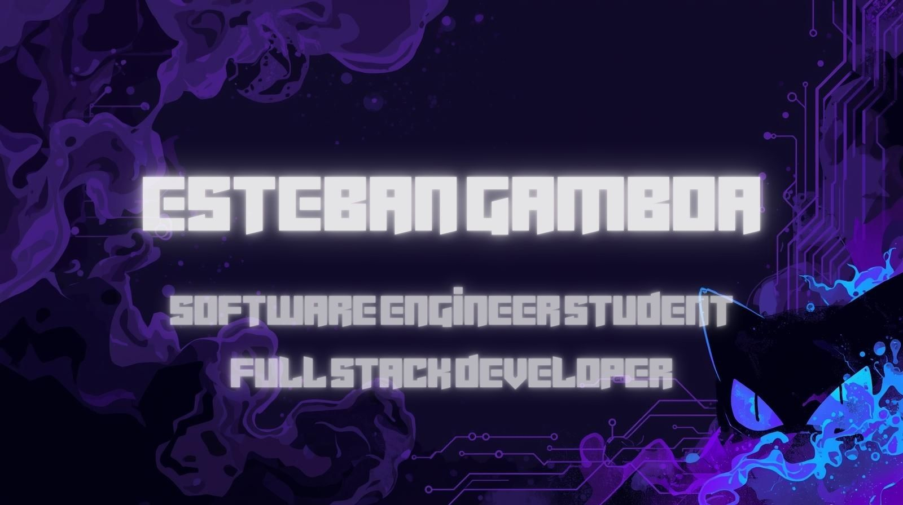

  
  
    

  

  <h1 align="center">Hi there! I'm <a href="https://www.linkedin.com/in/esteban-g-roman" target="_blank">Esteban Gamboa</a></h1>

  <h3 align="center">
    👾 Software Engineer Student | Full Stack Developer | Linux Enthusiast
  </h3>

  

    Based in <strong>Costa Rica</strong> 🇨🇷 | Building scalable solutions with <strong>LAMP Stack & Java</strong>
  

  

    
    
  

 

---

### 👻 About Me

I am an advanced **Software Engineering student** at **Universidad Fidélitas** (Class of 2027), passionate about backend logic, server infrastructure, and clean architecture. 

My journey involves creating dynamic web applications (Full Stack) and optimizing server environments using **Linux (Ubuntu)**. I treat bugs like ghosts... I hunt them down until the code is clean. 🟣

* 🔭 I’m currently working on **Medical Management Systems with PHP & MySQL**.
* 🌱 I’m currently learning **Advanced Java (Spring)** and **English (B2 Level)**.
* 🐧 I love **Linux**, Virtualization, and configuring secure Web Servers (Apache/UFW).
* ⚡ **Soft Skills:** Problem-solving, Agile adaptation, and Autodidactic learning.

 

### 🔮 Tech Stack & Spells

 

 

 

### 🧪 Featured Projects (My Laboratory)

| **Project** | **Description** | **Tech** |
| :--- | :--- | :--- |
| **[🏥 MedAgenda-CR](https://github.com/EstebanGamboaR/MedAgenda-CR)** | **Full Stack Medical System.** Manages appointments with intelligent Triage, patient records, and real-time dashboard. Optimized for **XAMPP**. |   |
| **[🌲 Good Wood System](https://github.com/EstebanGamboaR/Sistema-Facturacion-Java)** | **Java Desktop App.** Inventory and billing management for carpentry services using **OOP**, MVC architecture, and Swing. |   |
| **[🍥 Ninja Academy](https://github.com/EstebanGamboaR/Academia-Ninja-Web)** | **Interactive Web App.** A Naruto-themed task manager using **LocalStorage**, DOM Manipulation, and advanced CSS animations. |   |

 

### 📊 GitHub Stats 

 

  
  
<i>"I love code."</i> Thanks for visiting my profile!

