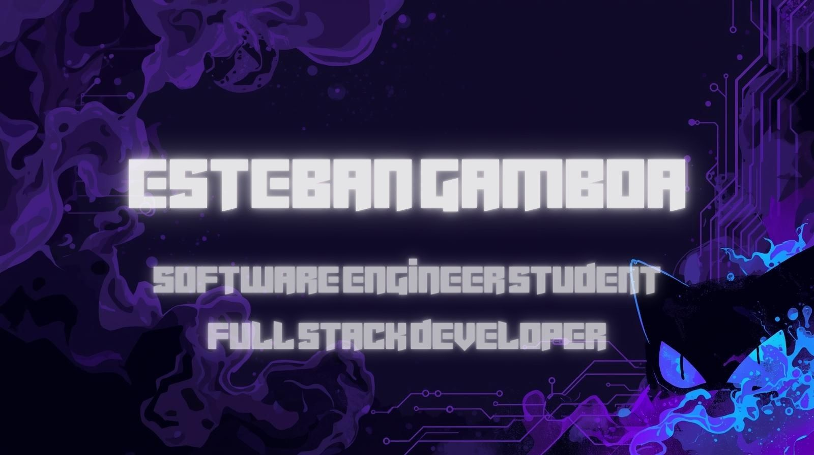

  
  
    

  

  <h1 align="center">Hi there! I'm <a href="https://www.linkedin.com/in/esteban-g-roman" target="_blank">Esteban Gamboa</a></h1>

  <h3 align="center">
    👾 Software Engineering Student | Full Stack Developer | Linux Enthusiast
  </h3>

  

    Based in <strong>Costa Rica</strong> 🇨🇷 | Building scalable solutions with <strong>Java · PHP · MySQL · LAMP Stack</strong>
  

  

    
    
    
  

 

---

### 👻 About Me

I am an advanced **Software Engineering student** at **Universidad Fidélitas** (Class of 2027), passionate about backend logic, clean architecture, and building real-world systems from scratch.

My work spans Full Stack web applications (PHP + MySQL + JS), Java desktop systems with custom data structures, and server infrastructure on Linux. I treat bugs like ghosts... I hunt them down until the code is clean. 🟣

- 🔭 Currently working on **Sistema de Eventos Deportivos** — data structures in Java (linked lists, stacks, queues)
- 🌱 Learning **Spring Framework** (Advanced Java) and deepening **English (B2)**
- 🐧 Passionate about **Linux**, server configuration (Apache/UFW) and virtualization
- 🎓 **Certified:** Scrum Fundamentals Certified (SFC) — SCRUMstudy #1155548
- ⚡ **Soft Skills:** Problem-solving, Agile adaptation, autodidactic learning

 

### 🔮 Tech Stack

 

 

 

### 🧪 Featured Projects

| **Project** | **Description** | **Tech** |
| :--- | :--- | :--- |
| **[🏥 MedAgenda-CR](https://github.com/EstebanGamboaR/MedAgenda-CR)** | **Full Stack Medical System.** Manages appointments with intelligent Triage, admin dashboard, MySQL Stored Procedures & Triggers for auditing. MVC REST API in native PHP. |   |
| **[🏆 Sports Event Manager](https://github.com/EstebanGamboaR/Sistema-Eventos-Deportivos)** | **Java Desktop App.** Full sports event management system built on custom data structures: linked lists, stacks (LIFO) and queues (FIFO) — all implemented from scratch without Java collections. |   |
| **[❓ Questions & Powers](https://github.com/EstebanGamboaR/questions-and-powers)** | **Java Trivia Game.** Quiz game with MySQL auth (stored procedures), Atbash cipher encryption built from scratch, real-time countdown timer, and a strategic power system (Shield / The Jester). |   |
| **[🌲 Good Wood System](https://github.com/EstebanGamboaR/Sistema-De-Gestion)** | **Java Desktop App.** Inventory and billing management for carpentry services using OOP with layered architecture (Gestores/Models). No external libraries. |   |
| **[🍥 Ninja Academy](https://github.com/EstebanGamboaR/Web-App)** | **Interactive Web App.** Naruto-themed mission board with CRUD, LocalStorage persistence, dynamic validations, and advanced CSS animations. |   |
| **[📋 Task Manager](https://github.com/EstebanGamboaR/Administrador-de-Tareas-Personales)** | **Python CLI App.** Personal task manager built in Python — CRUD operations, task prioritization, and persistent storage. |  |

 

### 📊 GitHub Stats 

 

  
  
<i>"Code is the closest thing we have to magic."</i> Thanks for visiting my profile!

